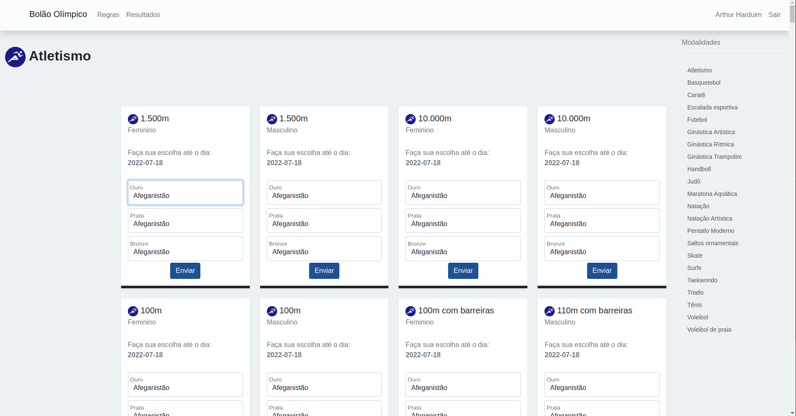

# Bolão Esportivo

Site para organização de bolões esportivos




## Instalação
- Fazer o registro de aplicativo no Azure Active Directory
  - TODO: descrever em mais detalhes
- Criar o arquivo `.env` com base no `.env.template`
- Preencher o arquivo `.env` com a senha do banco de dados e chaves do AzureAD
- Criar o container do banco de dados
 ```shell
 docker compose up -d
 ```
- Atualizar a lista de países participantes em [paises.json](config/paises.json)
- Atualizar a data de realização dos eventos em [modalidades.json](config/modalidades.json)
- Inicializar o banco de dados
 ```python
from bigcake.db import init_db, reset_db

init_db()
reset_db()
 ```
- Iniciar o servidor web:
```shell
gunicorn --bind 127.0.0.1:3000 bigcake:app
```

## TODO
- Documentação
  - [Registro do aplicativo na API para login via SSO Microsoft](https://docs.microsoft.com/en-us/samples/azure-samples/ms-identity-python-webapp/ms-identity-python-webapp/#step-2-register-the-sample-with-your-azure-active-directory-tenant)
  - Instruções de implantação
  - Manual do usuário
- Parametrizar OID do usuário administrador
